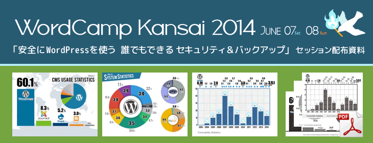

WordCampKansai2014-Infographics
=====
  
  

##このファイルについて
2014年 6月7日(土)、8日（日）開催  
Word Camp Kansai 2014  （<http://2014.kansai.wordcamp.org/>）  
「安全にWordPressを使う 誰でもできるセキュリティ＆バックアップ」セッションの  
配布用のインフォグラフィック（統計情報）です。どうぞご活用ください:blush:。  
（右の「Download ZIP」ボタンからダウンロードできます。）
  
  
:bar_chart:**CMS_UsageStatistics.png** CMS全体におけるWordPress比率  
:bar_chart:**SystemStatistics.png** WordPress上で動いているシステムのバージョン  
:bar_chart:**VulnerabilityStatistics.png** 脆弱性の統計  
:white_circle:**monochrome.pdf** 白黒資料用pdf  

  
  
##About
I will distribute this infographic.  
It was used in WordCamp Kansai 2014 [Security and backup] Session.  
Please do practically apply these materials.  
(You can download right from the "Download ZIP" button.)  
  
WordCamp Kansai 2014 <http://2014.kansai.wordcamp.org/>  
  
  
##License
この画像のライセンスはGPL v2です。
  
WordCampは100％GPLです。  
WordCampについて詳しくは　<http://japan.wordcamp.org/>  
  
  
  
Released under the GPLv2 license.  
WordCamp is GPL 100%.  
Learn more about WordCamp.　<http://central.wordcamp.org/>  
  

